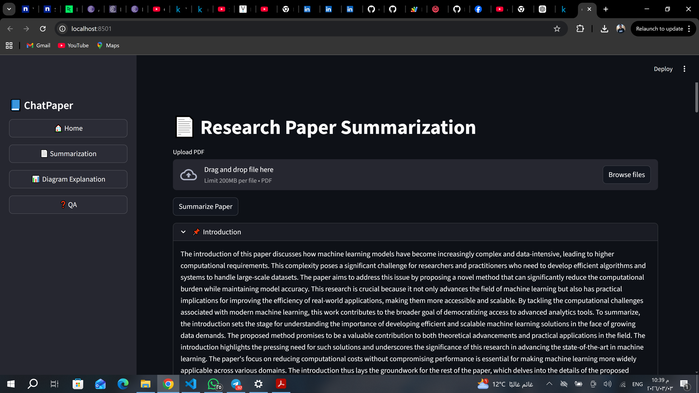
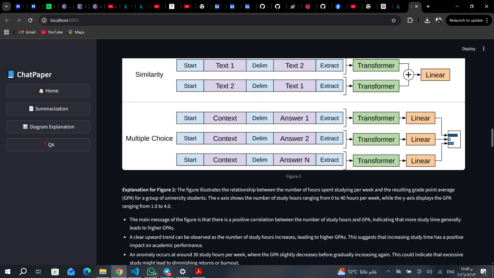
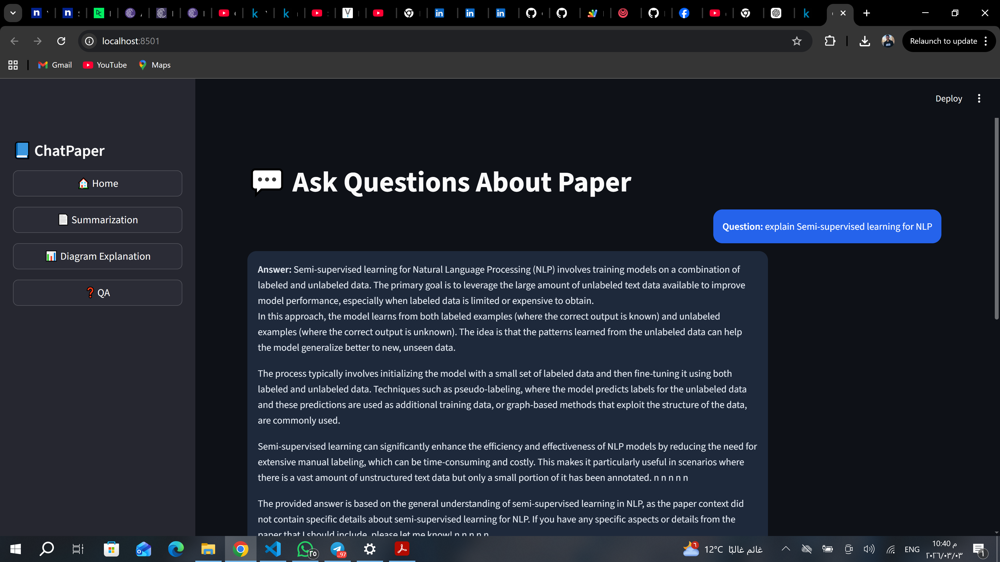

# 📘 ChatPaper – AI Research Assistant

**ChatPaper** is an AI-powered research assistant designed to help researchers, students, and scientists explore academic papers efficiently. It provides **paper summarization, question answering, diagram explanations, and equation understanding** in an interactive and user-friendly way.

---

## 📝 Overview
**ChatPaper** is an AI-powered research assistant that helps researchers, students, and scientists **quickly explore academic papers**. It streamlines reading, understanding, and extracting knowledge from research PDFs by providing:

- **Structured paper summarization**  
- **Question answering using RAG**  
- **Diagram explanations with textual insights**  
- **Mathematical equation extraction and LaTeX rendering**

The tool is designed to make complex papers more accessible and interactive, helping users **focus on insights rather than manual reading**.

---

## 🌟 Features

### 1️⃣ Paper Summarization
- Automatically analyzes PDF research papers.
- Generates **comprehensive and structured summaries** for each section.
- Removes duplicate content and presents a **clean, readable format**.
- Summarizes both sections and the overall paper.

### 2️⃣ Question Answering (RAG)
- Ask specific questions about the content of a paper.
- Uses **Retrieval-Augmented Generation (RAG)** to find relevant information from the paper.
- Provides precise answers, referencing the original context.
- Useful for complex or technical questions within the paper.

### 3️⃣ Diagram Explanation
- Detects figures, charts, and images in PDFs.
- Generates **detailed textual explanations** for each figure.
- Displays the figure alongside its explanation for better understanding.
- Ideal for analyzing visual results and diagrams.

### 4️⃣ Equation Explanation
- Detects mathematical equations in papers.
- Converts equations into **LaTeX for display**.
- Provides detailed explanations of each equation, including symbol definitions.
- Helps understand **mathematical models and formulas** used in research.

---

## ⚡ System Architecture

```text
+---------------------+      +---------------------+      +---------------------+
|                     |      |                     |      |                     |
|   User Interface    | ---> |  FastAPI Backend    | ---> |  LangChain + FAISS  |
|   (Streamlit)       |      |  Endpoints          |      |  Vector DB          |
|   - Summarization   |      |  - /summary         |      |  - Stores embeddings|
|   - QA              |      |  - /q&a             |      |  - Retrieves docs   |
|   - Diagrams        |      |  - /diagram_explanation |  |                     |
|   - Equations       |      |  - /equation_explanation|  |                     |
+---------------------+      +---------------------+      +---------------------+
                                      |
                                      v
                             +---------------------+
                             |    AI Models        |
                             |  - LLMs (GPT, etc.)|
                             |  - Sentence Transformers |
                             |  - HuggingFace Models|
                             +---------------------+
                                      |
                                      v
                             +---------------------+
                             |  PDF Processing     |
                             |  - PyMuPDF          |
                             |  - PyPDF2           |
                             |  - Equation & Diagram|
                             |    extraction       |
                             +---------------------+
```
---

## 🛠️ Technology Stack
- **Frontend:** Streamlit  
- **Backend API:** FastAPI  
- **Text Database:** LangChain + FAISS  
- **AI Models:** HuggingFace Transformers, Sentence Transformers, LLMs  
- **PDF Processing:** PyMuPDF, PyPDF2  
- **Mathematical Equations:** LaTeX + Sympy  
- **Temporary Tunnel:** ngrok (development only)

---

## ⚡ How to Use
1. **Upload a PDF:** Go to the Summarization page and upload your paper.  
2. **Summarize Paper:** Click "Summarize Paper" to generate structured summaries.  
3. **Ask Questions:** Navigate to the QA page and type your question; the system will provide answers using RAG.  
4. **Explain Diagrams:** Go to the Diagram page and click "Extract Figures & Explain."  
5. **Explain Equations:** Equations are automatically detected, displayed in LaTeX, and explained step by step.

---

## 🖼️ User Interface
- Modern **dark mode** interface for comfortable reading.  
- Chat-like messages: **User Question → AI Answer**.  
- Supports displaying images, figures, and equations interactively.

---
## Project Structure
```text

ChatPaper/
├── app.py                   # Streamlit frontend
├── api/
│   ├── main.py              # FastAPI endpoints
│   ├── vector_db.py         # Vector database builder
│   ├── equation_utils.py    # Equation extraction & explanation
│   └── diagram_utils.py     # Figure extraction & explanation
├── models/                  # Pretrained AI models
├── requirements.txt         # Required packages
└── README.md
```
---
## ⚙️ Installation Steps

Follow these steps to set up ChatPaper locally or on Google Colab.

---

### 1️⃣ Create Virtual Environment (Local)

```bash
# Create a virtual environment
python -m venv venv

# Activate the virtual environment (Windows)
venv\Scripts\activate

# Activate the virtual environment (Linux / Mac)
source venv/bin/activate
```
### 2️⃣ Install Dependencies

**Option 1: Install from `requirements.txt`**

```bash
pip install -r requirements.txt
```
### 3️⃣ Configure Environment Variables
- Create a .env file in the project root:

```bash
API_KEY=your_secret_api_key
```
## Run the Application

### 4️⃣ Run the Backend API (FastAPI)

- From the project root directory, run:
```bash
uvicorn api.main:app --reload
```
- Default URL: http://127.0.0.1:8000/
- Swagger Documentation: http://127.0.0.1:8000/docs

### 5️⃣ Run the Frontend (Streamlit)

- From the project root directory, run:

```bash
streamlit run app.py
```
### 🖼️ Screenshots

**Paper Summarization Page**



**Diagram Explanation**



**Question Answering**



## 🚀 Future Improvements

- Support for more file formats (DOCX, HTML).  
- Enhance RAG for handling more complex questions.  
- Support more complex equations with step-by-step explanations.  
- Deploy as a SaaS platform for public access.  
